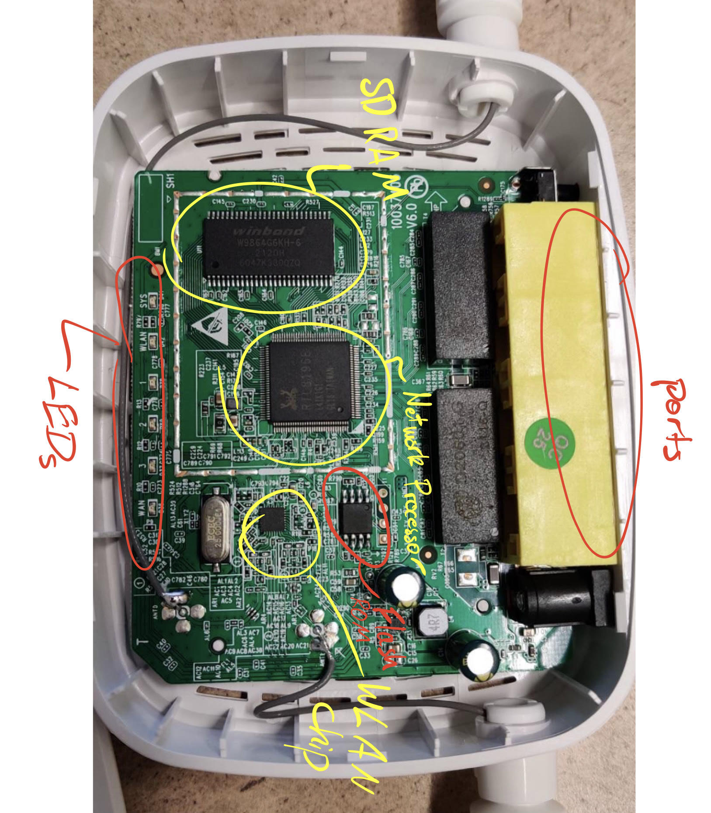
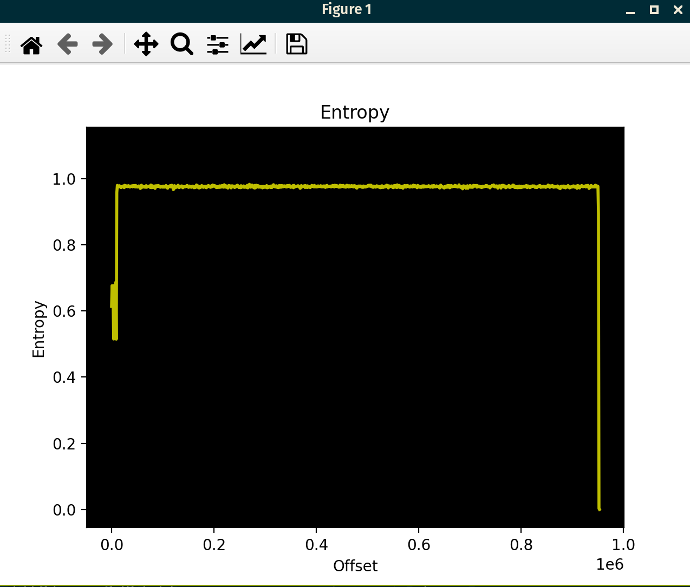

# Final Project Writeup - CS69

## Team Members

Our group was composed of Lucas Wilbur, Kris (Chavin) Udomwongsa, and Tian Xia.

## Process

### Step 1: Physical Analysis

To begin our reverse engineering, we opened the Tenda n301 router and examined contents inside.  For each chip or other internal component, we closely inspected it to find any visible writing or information.  Then, we turned to research on the internet to gain a more complete picture of what the role of each chip was.

| Hardware Object Purpose | Serial # / Other Writing |
| :---------------------: | :----------------------: |
|    Network Processor    |       RTL8196E-CG        |
|         SD Ram          |       W9864G6KH-6        |
|        WLan Chip        |                          |
|        *unknown*        |  H25S80 BG 20k0 AP2N113  |



### Step 2: OSINT

The first step of intelligence gathering, as shown in the table above, was identifying the various chips and other hardware used to run the n301 and determining their purpose.

Once this had been completed, we continued to gather whatever information we could.  For general, basic information about the n301, we could refer to its [specs on the Tenda website](https://www.tendacn.com/product/specification/N301.html).  We found a public release of the router's [most recent firmware update](https://www.tendacn.com/us/download/detail-3977.html) on the website as well, which would come in handy for later static analysis.

Perhaps most importantly, we found the [official datasheet for the RTL8196E-CG network processor](http://www.hytic.net/upload/files/2015/09/REALTEK-RTL8196E.pdf) used by the router.  Included in that datasheet was such vital information as:

```
"The RTL8196E supports one flash memory chip ( SF_CS0#). The interface supports SPI flash memory. When Flash is used, the system will boot from KSEG1 at virtual address 0xBFC0_0000 (physical address: 0x1FC0_0000)."
```

It also listed the architecture of the chip as being MIPS, which was an important step for later static analysis.  However, with the many different varieties of MIPS in existance, further exploration was required.

### Step 3: Static Binwalk Firmware Analysis

As a classic first step, we naturally called `strings` on the firmware update that we downloaded.  Among the large amount of useless output was the text:

```
Xdecompressing kernel:
done decompressing kernel.
start address: 0x%08x
0123456789abcdefghijklmnopqrstuvwxyz
0123456789ABCDEFGHIJKLMNOPQRSTUVWXYZ
<NULL>
 -- System halted
Uncompressing...
LZMA: Too big uncompressed stream
LZMA: Incorrect stream properties
Malloc error
Memory error
Out of memory
LZMA: Decoding error = %d
 done, booting the kernel.
```

Continuing our analysis, we turned to using `binwalk` on the firmware.

```
$ binwalk -emd3 N301.bin > binwalk.out

DECIMAL    HEXADECIMAL   DESCRIPTION

10292     0x2834     LZMA compressed data, properties: 0x5D, dictionary size: 8388608 bytes, uncompressed size: 3039160 bytes
```

Our first attempt yielded only compressed data, instead of a functional filesystem.  However, examining that data further continued to give results.

```
$ cat binwalk.out | grep arch
0             0x0             eCos kernel exception handler, architecture: MIPS, exception vector table base address: 0x80000200
128           0x80            eCos kernel exception handler, architecture: MIPS, exception vector table base address: 0x80000200

$ binwalk --disasm tenda/US_N301V6.0re_V12.02.01.61_multi_TDE01.bin 

DECIMAL       HEXADECIMAL     DESCRIPTION
--------------------------------------------------------------------------------
12            0xC             MIPS executable code, 32/64-bit, big endian, at least 1250 valid instructions
```

Thus, we determined the exact identity of the architecture used for this device: 32/64 bit big-endian MIPS.

To verify that this document is compressed, and not under some form of encyption, we performed entropy analysis on the firmware using `binwalk -E`

```
$ binwalk -E N301.bin

DECIMAL       HEXADECIMAL     ENTROPY
--------------------------------------------------------------------------------
0             0x0             Falling entropy edge (0.613818)
10240         0x2800          Rising entropy edge (0.957594)
952320        0xE8800         Falling entropy edge (0.002793)
```



This entropy graph is consistent with whole-file compression, thus all-but-confirming that it is indeed compressed, not encrypted.

After much research and many attempts to decompress the firmware attained through binwalk, we discovered [another person's attempts to reverse engineer a tenda n301](https://github.com/w3slee/Tenda-Firmware-Reversing ).

In their github repository, they had a decompressed version of the n301 firmware that could be loaded successfully into Ghidra and yield readable assembly code.  Sadly, they did not include any instructions or information on how they accomplished this.  Thus, considering the time constraints of our final project, we decided that our time would be best used to analyze their decompressed binary, instead of losing further time trying to decompress ours. 

### Step 4: Static Ghidra Firmware Analysis

