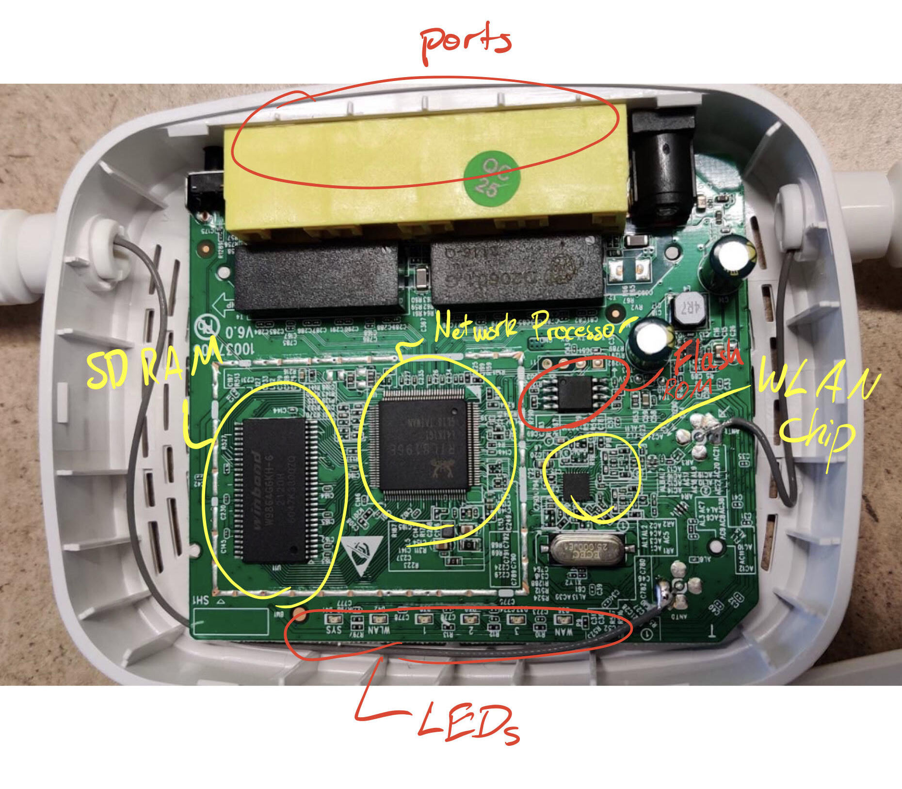

# Final Project Writeup - CS69

## Team Members

Our group was composed of Lucas Wilbur, Kris (Chavin) Udomwongsa, and Tian Xia.

## Process

### Step 1: Physical Analysis

To begin our reverse engineering, we opened the Tenda n301 router and examined contents inside.  For each chip or other internal component, we closely inspected it to find any visible writing or information.  Then, we turned to research on the internet to gain a more complete picture of what the role of each chip was.

| Hardware Object Purpose | Serial # / Other Writing |
| :---------------------: | :----------------------: |
|    Network Processor    |       RTL8196E-CG        |
|         SD Ram          |       W9864G6KH-6        |
|        WLan Chip        |                          |
|        *unknown*        |  H25S80 BG 20k0 AP2N113  |



### Step 2: OSINT

The first step of intelligence gathering, as shown in the table above, was identifying the various chips and other hardware used to run the n301 and determining their purpose.

Once this had been completed, we continued to gather whatever information we could.  For general, basic information about the n301, we could refer to its [specs on the Tenda website](https://www.tendacn.com/product/specification/N301.html).  We found a public release of the router's [most recent firmware update](https://www.tendacn.com/us/download/detail-3977.html) on the website as well, which would come in handy for later static analysis.

Perhaps most importantly, we found the [official datasheet for the RTL8196E-CG network processor](http://www.hytic.net/upload/files/2015/09/REALTEK-RTL8196E.pdf) used by the router.  Included in that datasheet was such vital information as:

```
"The RTL8196E supports one flash memory chip ( SF_CS0#). The interface supports SPI flash memory. When Flash is used, the system will boot from KSEG1 at virtual address 0xBFC0_0000 (physical address: 0x1FC0_0000)."
```

It also listed the architecture of the chip as being MIPS, which was an important step for later static analysis.  However, with the many different varieties of MIPS in existance, further exploration was required.

### Step 3: Static Binwalk Firmware Analysis

As a classic first step, we naturally called `strings` on the firmware update that we downloaded.  Among the large amount of useless output was the text:

```
Xdecompressing kernel:
done decompressing kernel.
start address: 0x%08x
0123456789abcdefghijklmnopqrstuvwxyz
0123456789ABCDEFGHIJKLMNOPQRSTUVWXYZ
<NULL>
 -- System halted
Uncompressing...
LZMA: Too big uncompressed stream
LZMA: Incorrect stream properties
Malloc error
Memory error
Out of memory
LZMA: Decoding error = %d
 done, booting the kernel.
```

Continuing our analysis, we turned to using `binwalk` on the firmware.

```
$ binwalk -emd3 N301.bin > binwalk.out

DECIMAL    HEXADECIMAL   DESCRIPTION

10292     0x2834     LZMA compressed data, properties: 0x5D, dictionary size: 8388608 bytes, uncompressed size: 3039160 bytes
```

Our first attempt yielded only compressed data, instead of a functional filesystem.  However, examining that data further continued to give results.

```
$ cat binwalk.out | grep arch
0             0x0             eCos kernel exception handler, architecture: MIPS, exception vector table base address: 0x80000200
128           0x80            eCos kernel exception handler, architecture: MIPS, exception vector table base address: 0x80000200

$ binwalk --disasm tenda/US_N301V6.0re_V12.02.01.61_multi_TDE01.bin 

DECIMAL       HEXADECIMAL     DESCRIPTION
--------------------------------------------------------------------------------
12            0xC             MIPS executable code, 32/64-bit, big endian, at least 1250 valid instructions
```

Thus, we determined the exact identity of the architecture used for this device: 32/64 bit big-endian MIPS.

To verify that this document is compressed, and not under some form of encyption, we performed entropy analysis on the firmware using `binwalk -E`

```
$ binwalk -E N301.bin

DECIMAL       HEXADECIMAL     ENTROPY
--------------------------------------------------------------------------------
0             0x0             Falling entropy edge (0.613818)
10240         0x2800          Rising entropy edge (0.957594)
952320        0xE8800         Falling entropy edge (0.002793)
```


This entropy graph is consistent with whole-file compression, thus all-but-confirming that it is indeed compressed, not encrypted.

After much research and many attempts to decompress the firmware attained through binwalk, we discovered [another person's attempts to reverse engineer a tenda n301](https://github.com/w3slee/Tenda-Firmware-Reversing ).

In their github repository, they had a decompressed version of the n301 firmware that could be loaded successfully into Ghidra and yield readable assembly code.  Sadly, they did not include any instructions or information on how they accomplished this.  Thus, considering the time constraints of our final project, we decided that our time would be best used to analyze their decompressed binary, instead of losing further time trying to decompress ours. 

### Step 4: Static Ghidra Firmware Analysis

After loading the decompressed firmware into Ghidra, we commenced static analysis.  Based on the references to files we found within various strings in the firmware, we have reason to believe that the firmware we found still contains files in it. 

Between `0x002b0ee8` and `0x002b5d6`, we see many pngs and a gif; these are most likely used in the user interface presented when you connect to the router to set it up.  Directly after these addresses is a section of HTML stored as a string.  This, too, seems like it's is used when setting up or configuring the router, as indicated by the inclusion of text like "Operating Mode" and "Blacklisted Devices".

Furthermore we found a very long section of JavaScript, stored as a string, from memory address `0x001ddae0` onwards.  However, based on our analysis, we did not discover any locations in the firmwhere that touched the JavaScript string, which would imply that this JavaScript is a file stored in the firmware.  Thus, this further supports our hypothesis that the firmware still contains multiple files.  To see an example of one of the segments of JavaScript, please see this snippet below (which we have manually added some newlines to for clarity about the various functions it performs):

```javascript
define((function(require,exports,module){
var pageModule=new PageLogic({getUrl:\"goform/getParentControl\",modules:\"parentCtrlList,parentAccessCtrl\",setUrl:\"goform/setParentControl\"});
pageModule.modules=[],module.exports=pageModule,pageModule.beforeSubmit=function(){var urlInputVal=$(\"#urlFilterAllow\").val(),msg=CheckUrlVolidate();return !msg||\"\"===urlInputVal||(top.mainLogic.showModuleMsg(msg),!1)};
var attachedModule=new AttachedModule;function AttachedModule(){var timeFlag;function getOnlineListData(){var str=\"\",i=0,listArry=$(\"#onlineList\").children(),len=listArry.length,hostname;
for(i=0;i<len;i++){
  str+=(hostname=$(listArry).eq(i).children().find(\"div\").eq(0).attr(\"data-hostName\"))+\"\\t\",hostname==$(listArry).eq(i).children().find(\"input\").val()?str+=\"\\t\":str+=$(listArry).eq(i).children().find(\"input\").val()+\"\\t\", str+=$(listArry).eq(i).children().find(\"div\").eq(0).attr(\"alt\")+\"\\t\",  str+=$(listArry).eq(i).children().eq(1).html()+\"\\t\", str+=$(listArry).eq(i).children().eq(3).find(\"div\").hasClass(\"icon-toggle-on\")+\"\\n\"}
return str=str.replace(/[\\n]$/,\"\")
}


function editDeviceName(){
        var deviceName=$(this).parent().prev(\"div\").text();$(this).parent().parent().find(\"div\").hide(), $(this).parent().parent().find(\"input\").show().addClass(\"edit-old\"), $(this).parent().parent().find(\"input\").val(deviceName), $(this).parent().parent().find(\"input\").focus()
}


function getEnablelist(){
var index=0,i=0,$listArry=$(\"#onlineList\").children(),length=$listArry.length;
for(i=0;i<length;i++){
$listArry.eq(i).children().eq(3).find(\"div\").hasClass(\"icon-toggle-on\")&&index++
}
return index
}


function changeDeviceManage(){
var className;
if(\"switch icon-toggle-on\"==(this.className||\"switch icon-toggle-on\")){
this.className=\"switch icon-toggle-off\"}else{if(getEnablelist()>=10){
return void top.mainLogic.showModuleMsg(_(\"A maximum of %s entries can be added.\"[10]))}
this.className=\"switch icon-toggle-on\"}}
    

function refreshTableList(
{$.get(\"goform/getParentControl\"+getRandom()+\"&modules=parentCtrlList\",updateTable), clearTimeout(timeFlag), timeFlag=setTimeout((function(){refreshTableList()}), 5000), pageModule.pageRunning||clearTimeout(timeFlag)
}
    

function updateTable(obj){
  checkIsTimeOut(obj) && top.location.reload(!0);
  try{obj=$.parseJSON(obj)}
  catch(e){obj={}}
  if(isEmptyObject(obj)){
    top.location.reload(!0)}
  else{
    if(pageModule.pageRunning){
      var getOnlineList=obj.parentCtrlList, $onlineTbodyList=$(\"#onlineList\").children(), onlineTbodyLen=$onlineTbodyList.length,getOnlineLen=getOnlineList.length,j=0,i=0,oldMac,newMac,rowData=new Array(onlineTbodyLen),refreshObj=new Array(getOnlineLen),newDataArray=[];
for(i=0;i<getOnlineLen;i++){
                                               for(newMac=getOnlineList[i].parentCtrlMAC.toUpperCase(),refreshObj[i]={},j=0;j<onlineTbodyLen;j++){
        var $nameDom=$onlineTbodyList.eq(j).children().eq(0).find(\".device-name-show\");(oldMac=$nameDom[0]?$nameDom.eq(0).attr(\"alt\").toUpperCase():\"\")==newMac&&(rowData[j]={},$onlineTbodyList.eq(j).children().eq(2).html(formatSeconds(getOnlineList[i].parentCtrlConnectTime)),rowData[j].refresh=!0,refreshObj[i].exist=!0),$onlineTbodyList.eq(j).children().eq(0).find(\"input\").eq(0).hasClass(\"edit-old\")&&(rowData[j]={},rowData[j].refresh=!0)}}
for(i=0;i<getOnlineLen;i++{
                                                                  refreshObj[i].exist||newDataArray.push(getOnlineList[i])}for(j=0;j<onlineTbodyLen;j++){rowData[j]&&rowData[j].refresh||$onlineTbodyList.eq(j).remove()}0!==newDataArray.length&&creatOnlineTable(newDataArray)}}}
function creatOnlineTable(obj){
  var len=obj.length, i=0, str=\"\",prop,hostname,divElem,divElem1,trElem,tdElem;for(i=0;i<len;i++){trElem=document.createElement(\"tr\");var tdStr=\"\";
  for(prop in obj[i]){hostname=\"\"!=obj[i].parentCtrlRemark?obj[i].parentCtrlRemark:obj[i].parentCtrlHostname,\"parentCtrlHostname\"==prop?(tdStr+='<td><input type=\"text\" class=\"form-control none device-name\" style=\"width:66%;\" value=\"\" maxLength=\"63\" />',tdStr+='<div class=\"col-xs-8 span-fixed device-name-show\"></div>',tdStr+='<div class=\"col-xs-2 editDiv\"><span class=\"ico-small icon-edit\" title=\"'+_(\"Edit\")+'\">&nbsp;</span></div></td>'):\"parentCtrlIP\"==prop?tdStr+='<td class=\"hidden-xs\">'+obj[i][prop]+\"</td>\":\"parentCtrlConnectTime\"==prop?tdStr+='<td class=\"hidden-xs\" data-onlinetime=\"'+obj[i][prop]+'\">'+formatSeconds(obj[i][prop])+\"</td>\":\"parentCtrlEn\"==prop&&(\"true\"==obj[i][prop]?tdStr+=\"<td class='internet-ctl' style=''><div class='switch icon-toggle-on'></div></td>\":tdStr+=\"<td class='internet-ctl' style=''><div class='switch icon-toggle-off'></div></td>\")}$(trElem).html(tdStr),$(trElem).find(\".device-name\")[0].value=hostname;var $deviceNameShow=$(trElem).find(\".device-name-show\");$deviceNameShow.attr(\"title\",hostname),$deviceNameShow.attr(\"alt\",obj[i].parentCtrlMAC),$deviceNameShow.attr(\"data-hostName\",obj[i].parentCtrlHostname),$deviceNameShow.attr(\"data-remark\",hostname),void 0!==$deviceNameShow.text()?$deviceNameShow[0].innerText=hostname:$deviceNameShow[0].textContent=hostname,$(\"#onlineList\").append($(trElem))}0==$(\"#onlineList\").children().length&&(str=\"<tr><td colspan='2' class='no-device'>\"+_(\"No device\")+\"</td></tr>\",$(\"#onlineList\").append(str)),top.mainLogic.initModuleHeight()}this.moduleName=\"parentCtrlList\",this.init=function(){this.initEvent()},this.initEvent=function(){$(\"#onlineList\").delegate(\".switch\",\"click\",changeDeviceManage),$(\"#onlineList\").delegate(\".icon-edit\",\"click\",editDeviceName),$(\"#onlineList\").delegate(\".form-control\",\"blur\",(function(){$(this).val()==$(this).next().attr(\"data-remark\")&&$(this).removeClass(\"edit-old\"),$(this).next().attr(\"title\",$(this).val()),$(this).next().text($(this).val()),$(this).next().show(),$(this).next().next().show(),$(this).hide()})),$(\"#urlFilterAllow\").on(\"keydown\",(function(e){var charCode;13==(e.keyCode||e.charCode)&&(window.event?window.event.returnValue=!1:e.preventDefault())}))},this.initValue=function(onlineArr){$(\"#onlineList\").html(\"\"),creatOnlineTable(onlineArr),timeFlag=setTimeout((function(){refreshTableList()}),5000),this.adjustWidth()},this.adjustWidth=function(){window.innerWidth<375&&$(\".span-fixed\").css(\"width\",\"90px\")},this.checkData=function(){var deviceName=\"\",$listTable=$(\"#onlineList\").children(),length=$listTable.length,$td,i=0;for(i=0;i<length;i++){if(\"\"==(deviceName=($td=$listTable.eq(i).children()).find(\"input\").eq(0).val()).replace(/[ ]/g,\"\")){return $td.find(\"input\").eq(0).focus(),_(\"No space is allowed in a device name.\")}}},this.getSubmitData=function(){var data={module1:this.moduleName,onlineList:getOnlineListData()};return objToString(data)}}


function CheckUrlVolidate(){
var url=$(\"#urlFilterAllow\").val(),len=$(\"#urlList\").children().length,i=0;if(\"\"==url){return $(\"#urlFilterAllow\").focus(),_(\"Please input a key word of domain name!\")}if(!/^[-_~\\#%&\\|\\\\\\/\\?=+!*\\.()0-9a-zA-Z\\u4e00-\\u9fa5]+$/gi.test(url)){return $(\"#urlFilterAllow\").focus(),_(\"Please input a key word of domain name!\")}if(/^(\\.)(.+)?$/gi.test(url)){return $(\"#urlFilterAllow\").focus(),_(\"Please input a key word of domain name!\")}if(-1!==url.indexOf(\"..\")){return $(\"#urlFilterAllow\").focus(),_(\"Please input a key word of domain name!\")}var ret=$.validate.valid.url(url);if(ret){return $(\"#urlFilterAllow\").focus(),ret}var trList=$(\"#urlList\").children();for(i=0;i<len;i++){if(url==trList.eq(i).children().eq(1).find(\"div\").text()){return $(\"#urlFilterAllow\").focus(),_(\"This website is used. Please try another.\")}}return len>=32?_(\"A maximum of %s entries can be added.\",[32]):void 0}pageModule.modules.push(attachedModule);var restrictionModule=new RestrictionModule;


function RestrictionModule(){
function getScheduleDate(){var i=0,len=8,str=\"\";for(i=0;i<8;i++){$(\"#day\"+i)[0].checked?str+=\"1\":str+=\"0\"}return str}var oldDate;
function clickTimeDay(){var dataStr=getScheduleDate();\"day0\"==this.id?this.checked?translateDate(\"11111111\"):translateDate(\"00000000\"):\"1111111\"==dataStr.slice(1)?translateDate(\"11111111\"):translateDate(\"0\"+dataStr.slice(1))}


function translateDate(str){var dayArry=str.split(\"\"),len=dayArry.length,i=0;for(i=0;i<len;i++){$(\"#day\"+i)[0].checked=1==dayArry[i]}}


function changeUrlMode(){var urlMode=$(\"#parentCtrlURLFilterMode\").val();\"disable\"!=urlMode?($(\"#urlFilterWrap\").show(),\"permit\"==urlMode?$(\"#websiteLabel\").html(_(\"Unblocked Websites\")):$(\"#websiteLabel\").html(_(\"Blocked Websites\"))):$(\"#urlFilterWrap\").hide(),mainLogic.initModuleHeight()}


function addUrlList(){var url=$(\"#urlFilterAllow\").val(),len=$(\"#urlList\").children().length,i=0,msg=CheckUrlVolidate();if(msg){top.mainLogic.showModuleMsg(msg)}else{var str=\"\";str+=\"<tr>\",str+=\"<td align='center'>\"+(len+1)+\"</td>\",str+=\"<td><div class='span-fixed' style='width:200px;' title='\"+url+\"'>\"+url+\"</div></td>\",str+='<td align=\"center\"><span class=\"operate icon-del deleteUrl\"></span></td>',$(\"#urlList\").append(str),$(\"#urlFilterAllow\").val(\"\"),top.mainLogic.initModuleHeight()}}


function deUrlList(){for(var nextTr=$(this).parent().parent().nextAll(),len=nextTr.length,i=0;i<len;i++){nextTr[i].children[0].innerHTML=parseInt(parseInt(nextTr[i].children[0].innerHTML))-1}$(this).parent().parent().remove(),top.mainLogic.initModuleHeight()}


function getUrlListData(){var str=\"\",i=0,listArry=$(\"#urlList\").children(),len=listArry.length,urlInputVal=$(\"#urlFilterAllow\").val();for(i=0;i<len;i++){str+=$(listArry).eq(i).children().eq(1).find(\"div\").text()+\"\\n\"}return str=str.replace(/[\\n]$/,\"\"),\"\"!==urlInputVal&&(str+=\"\"!=str?\"\\n\"+$(\"#urlFilterAllow\").val():$(\"#urlFilterAllow\").val()),str}


function createUrlList(arry){var i=0,len=arry.length,str=\"\";for(i=0;i<len;i++){str+=\"<tr>\",str+=\"<td align='center'>\"+(i+1)+\"</td>\",str+=\"<td><div class='span-fixed' style='width:200px;' title='\"+arry[i]+\"'>\"+arry[i]+\"</div></td>\",str+='<td align=\"center\"><span class=\"operate icon-del deleteUrl\"></span></td>'}$(\"#urlList\").html(str)}this.moduleName=\"parentAccessCtrl\",this.init=function(){this.initHtml(),this.initEvent()},this.initHtml=function(){var hourStr=\"\",minStr=\"\",i=0;for(i=0;i<24;i++){hourStr+=\"<option value='\"+(\"100\"+i).slice(-2)+\"'>\"+(\"100\"+i).slice(-2)+\"</option>\"}for($(\"#startHour, #endHour\").html(hourStr),i=0;i<60;i++){i%5==0&&(minStr+=\"<option value='\"+(\"100\"+i).slice(-2)+\"'>\"+(\"100\"+i).slice(-2)+\"</option>\")}$(\"#startMin, #endMin\").html(minStr)},this.initEvent=function(){$(\"[id^=day]\").on(\"click\",clickTimeDay),$(\"#addUrl\").on(\"click\",addUrlList),$(\"#urlList\").delegate(\".deleteUrl\",\"click\",deUrlList),$(\"#parentCtrlURLFilterMode\").on(\"change\",changeUrlMode),$(\"#onlineList\").delegate(\".device-name\",\"keyup\",(function(){var deviceVal=this.value.replace(\"\\t\",\"\").replace(\"\\n\",\"\"),len=deviceVal.length,totalByte=getStrByteNum(deviceVal);if(totalByte>63){for(var i=len-1;i>0;i--){if((totalByte-=getStrByteNum(deviceVal[i]))<=63){this.value=deviceVal.slice(0,i);break}}}this.value=deviceVal}))},this.initValue=function(obj){$(\"#urlFilterAllow\").val(\"\"),$(\"#urlFilterAllow\").addPlaceholder(_(\"Enter website\")),translateDate(obj.parentCtrlOnlineDate),oldDate=obj.parentCtrlOnlineDate;var time=obj.parentCtrlOnlineTime.split(\"-\");$(\"#startHour\").val(time[0].split(\":\")[0]),$(\"#startMin\").val(time[0].split(\":\")[1]),$(\"#endHour\").val(time[1].split(\":\")[0]),$(\"#endMin\").val(time[1].split(\":\")[1]),$(\"#parentCtrlURLFilterMode\").val(obj.parentCtrlURLFilterMode),createUrlList(obj.parentCtrlURL),changeUrlMode()},this.checkData=function(){var date;if(\"00000000\"==getScheduleDate()){return _(\"Select at least one day.\")}var urlList=getUrlListData(),url=$(\"#urlFilterAllow\").val(),urlFilterMode=$(\"#parentCtrlURLFilterMode\").val();return\"\"===urlList&&\"\"===url&&\"disable\"!==urlFilterMode?_(\"Please input a key word of domain name!\"):void 0},this.getSubmitData=function(){var time=time=$(\"#startHour\").val()+\":\"+$(\"#startMin\").val()+\"-\"+$(\"#endHour\").val()+\":\"+$(\"#endMin\").val(),data={module2:this.moduleName,parentCtrlOnlineTime:time,parentCtrlOnlineDate:getScheduleDate(),parentCtrlURLFilterMode:$(\"#parentCtrlURLFilterMode\").val(),urlList:getUrlListData()};return objToString(data)}}pageModule.modules.push(restrictionModule)}));"
```

Based on our cursory analysis of this JavaScript, this seems like generic code tasked with managing interactions between different devices and different URLs.  This, of course, is a very standard and expected action for a router to be taking.  Due to our group having limited knowledge about networking, our understanding of the code was ultimately limited.

Apart from various strings we found in the firmware update, there are also many memory touches that we examined that went beyond the addresses of the firmware.  These touches, for example, frequently accessed addresses from `0xfffffff8000000` onwards.  These addresses might be data or functions, but we think it most likely that this is data being stored either in ROM/RAM, or on another chip in the device.  In that case, the address just shows us that it's accessing another component of the circuit.

## Conclusions

From this project, we've come to a variety of conclusions.  First and foremost, we've gained much insight into the processes of embedded device analysis, especially in how to effectively research information about the physical specs of devices, and how to use tools like `binwalk` to examine firmwmare images.

As was expected, we were not able to complete our analysis of the Tenda n301 router.  However, we've had quite some success in building the foundations for further investigation and analysis.  We hope to build on this ourselves, but also are glad to make it available to the greater RE community on GitHub, such that others looking into the Tenda n301 can benefit from our findings.  We believe that there is absolutely a path—with further work and expertise—to exploiting and gaining complete control of a Tenda n301 router.

